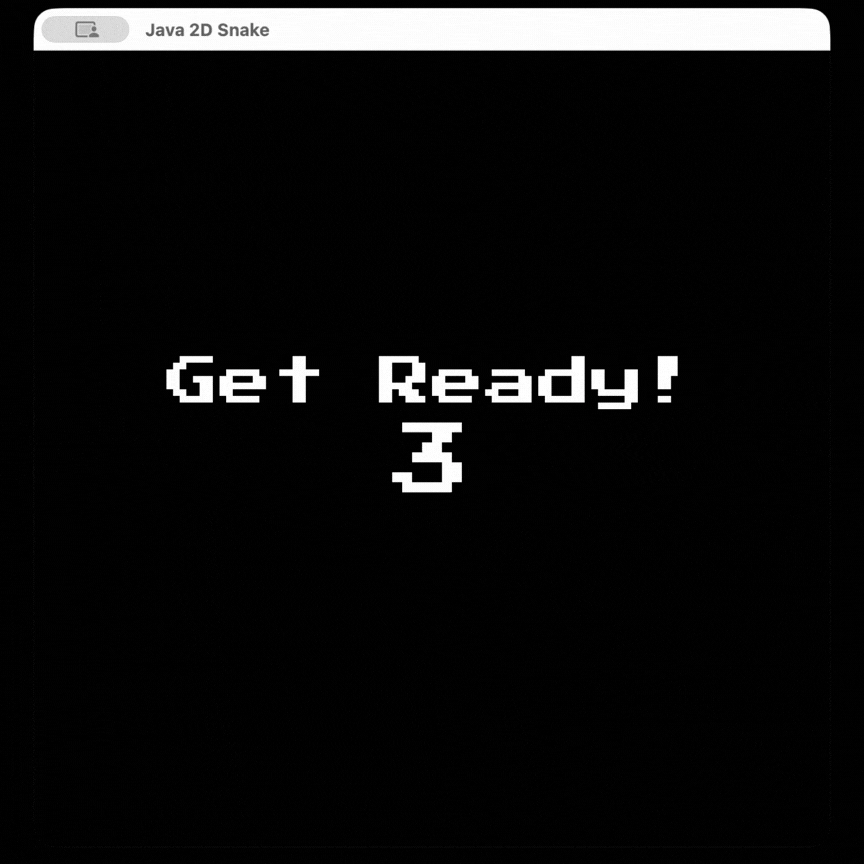

# 🐍 Snake Game (Java / Swing)

A classic Snake game built from scratch in Java using the Swing GUI toolkit and an `ActionListener`-driven game loop: no external dependencies, no game engine, just the JDK standard library.

<div align="center">
  
  <p><em>Figure 1: Application Demo</em></p>
</div>

## Features

- **Smooth game loop** driven by a `javax.swing.Timer`, rendered via custom `paintComponent` overrides on a `JPanel`
- **Buffered input queue**: arrow-key presses are queued (`ArrayDeque<Character>`) and validated one tile-move at a time, which prevents the classic "double-tap reversal" bug where a snake could instantly reverse into itself on fast input
- **Illegal-move protection**: a direction can never reverse 180° into the snake's own neck, using an `OPPOSITE` direction lookup map
- **Randomized food placement** that always avoids spawning on top of the snake's body
- **Live score tracking** rendered directly on the canvas
- **Win condition**: filling the entire board with the snake ends the game with a "YOU WIN!" screen, not just an infinite loop
- **Game-over screen** with final score, centered using `FontMetrics` for accurate text placement regardless of window size

## Controls

| Key | Action |
|---|---|
| ↑ | Move up |
| ↓ | Move down |
| ← | Move left |
| → | Move right |

## Requirements

- JDK 17+ (uses `switch` expressions and `Map.of`)

## Build & Run

```bash
javac SnakeGame.java
java SnakeGame
```

A 600×600 window will open and the game starts immediately.

## How It Works

The game is intentionally implemented in a small number of classes to keep the mechanics easy to follow:

- **`SnakeGame`**: the `JFrame` entry point; wires up the window and starts the Swing event thread via `SwingUtilities.invokeLater`.
- **`GamePanel`**: a `JPanel` that owns all game state and logic:
  - `x[]` / `y[]` arrays track each snake body segment's coordinates, shifted forward every tick in `move()`
  - `checkValidMove()` drains the buffered `directionQueue` and applies the first direction that isn't a 180° reversal of the current one
  - `checkFood()` and `checkCollisions()` run once per tick to grow the snake, detect self-collision, and detect wall collision
  - `paintComponent()` redraws the board, snake, food, and score every frame
- **`MyKeyAdapter`**: captures arrow-key input and pushes it onto the direction queue (capped at 2 pending moves) so rapid key presses can't be dropped or misapplied between ticks.

### A bug fix worth mentioning

An early version validated direction changes directly against the *current rendered* direction inside the key listener. Because key events and the game timer tick on different schedules, two fast key presses (e.g., ↑ then ← in quick succession before a repaint) could both be accepted even though the second was an illegal reversal relative to where the snake's head *would* be after the first move landed, causing the snake to run into itself. The fix ([`d6ffe22`](https://github.com/jiminl-princeton/SnakeGame/commit/d6ffe22)) introduced the buffered `directionQueue` so direction changes are validated sequentially against each other at tick time, not against stale render state.

## Project Structure

```
SnakeGame.java   # Full game source (entry point + game panel + input handling)
README.md
```

## Possible Extensions

- Increasing difficulty (speed ramps up as the snake grows)
- Persistent high score
- Pause/resume and restart-without-relaunch
- Configurable board size / difficulty presets

## License

No license specified; all rights reserved by the author.
